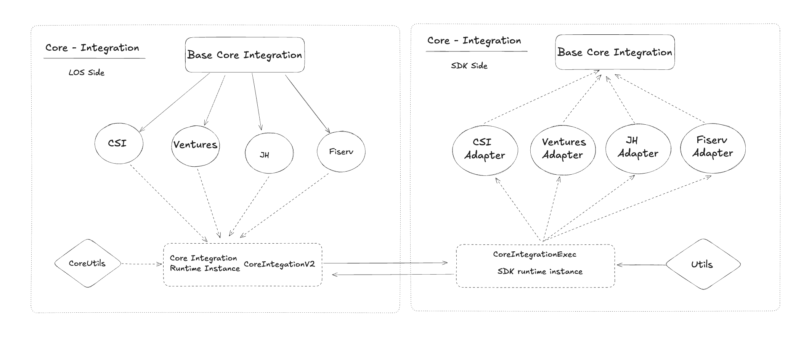

# Core Integration
Process of sending data from LOS to any servicing platform is done in core-integration.
Currently we have four core-integrations available in LOS:

1. **Ventures (Prod. ready)**: In ventures we have multiple tenant's, credentials and configs(some) are different for those.
    - [CDC](https://cdcsbfsandbox.venturesgo.com/)
    - [LFCU](https://lafayettesandbox.venturesgo.com/)
2. **CSI (Prod. ready)**
3. **Fiserv (Prod. ready)**
4. **JackHenry**  

To enable core-integration in local-setup/new tenant these are the things that are needed, these can be followed to add any new core-integration.
1. Add credentials for that core-tenant in credentials manager.
2. Add all the [necessary configs](ConfigList.md).
3. Add tenant_map for tenant specific switch.
4. Add entity_map to initialize CoreIntegration during runtime.

The process of making request and parsing response is done using internal [core integration package](https://github.com/Lenders-Cooperative/integrations-app-fiserv-django.git). LOS sends data and command name, the package jq-transforms this request data and sends an HTTP request to the specific core-service. The recived response is parsed specific to LOS and sent back to LOS. In simple words its **POSTMAN++** for LOS.

We'll divide this documentation in two parts:
- [LOS side](https://github.com/thesummitgrp/los-app-los-django/tree/main/los/services/vendors/coreintegration_api)
- [SDK side](https://github.com/Lenders-Cooperative/integrations-app-fiserv-django.git)

 

# LOS:
On the los side we follow a factory pattern to dynamically support multiple core-int's using same piece of code.  

> **Ques:** How do we determine which core_int to enable?  
> **Ans:** We have a config named **ci-tenant-map** which tells which SDK attributes are to be used for this tenant

```JSON
ci-tenant-map:{
    "tenant_name": {
        "module": "Module inside SDK to be used",
        "adapter": "Adapter of SDK to be used",
        "corebanking_name": "Name of the core banking system"
    }
}
```
Based on this tenant-map we call methods of that specific core integration only inside the SDK, this would make more sense once we proceed to SDK.  

As we can see in above diagram, we have a `BaseCoreIntegration` class which has all the common code, and then each child class extends from it inheriting its methods and attributes and overriding them wherever necessary. We also have a `CoreIntegrationUtils` which has common utilities for each of the core tenant's to use.  

Any normal API call to a core_int would look something like this:
- First a clean loan data from IntegrationSerializer will be passed to SDK along with a `config_key` for JQ transformation.
- The `config_key` determines which config would be used for JQ transform.
- The JQ transformed data is then sometimes is show to user for review, and then on some action from user this data is sent to core using the SDK component. The action from user can be in two ways:
    1. Using task's submit API call that will go in `boarding.py`.
    2. Using a POST call to `CoreIntegrationViewSet`.
- The flow after user's action:
    - Another JQ transformation is performed same as earlier.
    - The transformed data is then sent again to SDK along with a `flavour`.

**Flavour**: flavour is the name of API method that will be executed inside the SDK, this gives us freedom to execute multiple API's from same set of code. ex:
```Python
sdk = CoreIntegrationExec(loan_id, tenant, user_id)
sdk.create_customer(jq_transformed_data, flavour)
```
Here changing the flavour we can execute both `create_company`and `create_contact`

# SDK:
On the SDK side also we have a very clever design to make general code and execute the core integration based on `ci-tenant-map`.

```
root\
    |- core_integration\
        |- csi\
            |- csi_adapter.py
            |- api\
                |- csi_api.py
        |- fiserv\
            |- fiserv_adapter.py
            |- api\
                |- fiserv_api.py
        |- ventures\
            |- ventures_adapter.py
            |- api\
                |- ventures_api.py
        |- jackhenry\
            |- jackhenry_adapter.py
            |- api\
                |- jh_api.py
        |- core_int_wrapper.py
        |- utils.py
```
As you can see in the above structure we have `core_int_wrapper.py` which is the main entrypoint to SDK component, here we have a `get_transformed_payload` method that gives us jq transformed payload given an input_payload and config_key.  
We also call the adapter of each core integration based on `ci-tenant-map` in this file only.  
Now in each adapter file we use the jq_transformed_payload and flavour to make an API request to core.

# LOS side taks for each core integration

## Ventures:
Tasks:
- `BOARDING [capture - boarding_data]`
- `BOARDING [review - boarding_data]`
- `BOARDING [capture - cra_data]`
- `BOARDING [review - cra_data]`
- `BOARDING [review - ci_review_and_create]`
- `BOARDING [review - ci_review]`
- `BOARDING [review - boarding_and_cra_data]`

`BOARDING [review - payment_account]` is enabled specific to tenant.

## JackHenry:
Tasks:
- `BOARDING [capture - boarding_data]`
- `BOARDING [review - boarding_data]`
- `BOARDING [capture - cra_data]`
- `BOARDING [review - cra_data]`
- `BOARDING [capture: ci_account_generation]`
- `BOARDING [capture: ci_loan_creation]`
- `BORDING [review - boarding_and_cra_data]`


## Fiserv for SECU-MD:

Tasks for FISERV integration:
- `POST_APPROVAL_CHECK [review - ci_review]`
- `POST_APPROVAL_CHECK [capture - ci_account_generation]`
- `BOARDING [capture - boarding_data]`
- `BOARDING [capture - cra_data]`
- `BOARDING [review - ci_review_and_create]`
- `BOARDING [review - ci_review]`

## CSI: